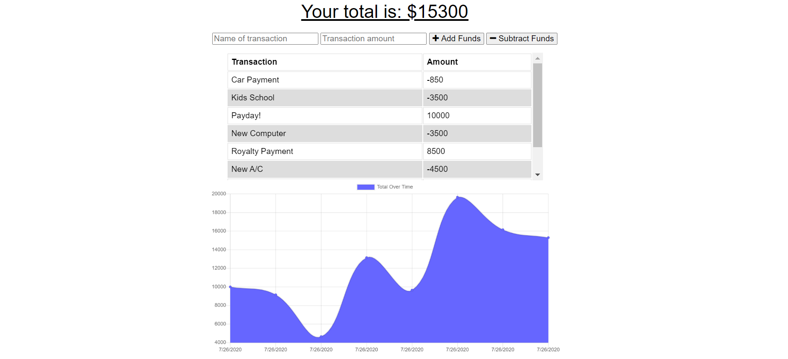

# Budget-tracker<h1 align="center"> PWA: Budget Tracker 👋</h1>
  

  
<p align="center">
    
    
    
    
    
    
</p>
   
## Description

🔍 A Mobile-First, Progressive Web Application (PWA) Budget Tracker that allows a user to track income and expenses online and offline.

**[Deployed Application](https://tracking-budget-heroku.herokuapp.com/)**
  
💻 Below is a screenshot of the application:
  


## User Story

```
AS AN avid traveler
I WANT to be able to track my withdrawals and deposits with or without a data/internet connection
SO THAT my account balance is accurate when I am traveling 
```

## Acceptance Criteria

```
GIVEN a budget tracker without an internet connection
WHEN the user inputs an expense or deposit
THEN they will receive a notification that they have added an expense or deposit
WHEN the user reestablishes an internet connection
THEN the deposits or expenses added while they were offline are added to their transaction history and their totals are updated
```
   
## Table of Contents
- [Description](#description)
- [User Story](#user-story)
- [Acceptance Criteria](#acceptance-criteria)
- [Table of Contents](#table-of-contents)
- [Installation](#installation)
- [Usage](#usage)
- [Testing](#testing)
- [Contributing](#contributing)
- [Questions](#questions)

## Installation
💾   

`npm install`
  
## Usage
💻   
  
`npm start`

With Nodemon:

`npm run watch`

## Testing
✏️

No current testing

## Contributing
:octocat: [Senait T Gerezgiher](https://github.com/senait77/Budget-tracker)

## Questions
✉️ Contact me with any questions: [email](senutekie77@gmail.com) , [GitHub](https://github.com/senait77/Budget-tracker)<br />